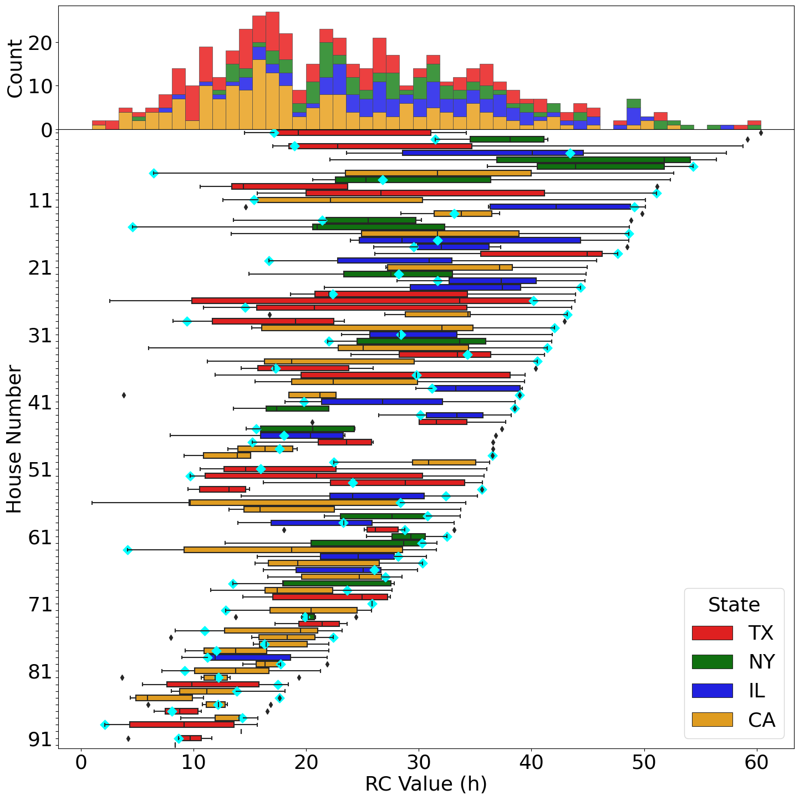

# Sensors4SingleZoneSystems

This repository contains the code and data used for our analysis of the role of remote sensors for comfort, energy, and demand response in single-zone multi-node systems. 

We are not able to publish the ecobee dataset of 1,000 houses mentioned in the analysis. However, the dataset is publicly available at https://www.osti.gov/biblio/1854924
 
Two publications have utilized this code in their analysis. 

---

## 📄 Publications

### Mulayim, Severnini, and Bergés (2024)
```bibtex
@article{Mulayim2024Unmasking, 
title={Unmasking the role of remote sensors in comfort, energy, and demand response}, 
volume={5}, 
DOI={10.1017/dce.2024.25}, 
journal={Data-Centric Engineering}, 
author={Mulayim, Ozan Baris and Severnini, Edson and Bergés, Mario}, 
year={2024}, 
pages={e28}
}
```

### Mulayim and Bergés (2023)

```bibtex
@inproceedings{mulayim2023unmasking,
author = {Mulayim, Ozan Baris and Berg\'{e}s, Mario},
title = {Unmasking the Thermal Behavior of Single-Zone Multi-Room Houses: An Empirical Study},
year = {2023},
isbn = {9798400702303},
publisher = {Association for Computing Machinery},
address = {New York, NY, USA},
url = {[https://doi.org/10.1145/3600100.3623724](https://doi.org/10.1145/3600100.3623724)},
doi = {10.1145/3600100.3623724},
abstract = {In single-zone multi-room houses (SZMRHs), temperature controls rely on a single probe near the thermostat. This practice often results in temperature discrepancies that cause both thermal discomfort and energy waste. Automatic vent registers, among other similar solutions, have faced adoption barriers due to installation, cost, and maintenance constraints. Utilizing per-room sensors with smart thermostats (STs) to control based on average temperature has gained acceptance by major ST manufacturers and demonstrated initial potential to diminish thermal discomfort. This paper empirically characterizes temperature discrepancies in SZMRHs and studies their effects, particularly with respect to thermal comfort and demand response (DR). Our aim is to leverage room-level data sourced from 1000 houses across the United States and two real-world testbeds to identify the shortcomings of SZMRHs and to diagnose the deficiencies via parameter identification. We discover that comfortable DR durations (CDRDs) for rooms are typically 70\% longer or 40\% shorter than for the room with the thermostat. When averaging, rooms at the control temperature’s bounds are typically deviated around -3°F to 2.5°F from the average. Moreover, in 95\% of houses, we identified one or two rooms experiencing notably higher solar gains compared to the rest of the rooms, while 85\% and 70\% of houses demonstrated lower heat input and poor insulation, respectively. This study serves as a benchmark for assessing thermal comfort and DR services in the existing housing stock, while also highlighting room-level retrofitting needs. Our approach sets the stage for more granular, precise control strategies of SZMRHs.},
booktitle = {Proceedings of the 10th ACM International Conference on Systems for Energy-Efficient Buildings, Cities, and Transportation},
pages = {21–30},
numpages = {10},
keywords = {demand response, grey box modeling, sensor networks, smart thermostats, thermal comfort, thermal parameter identification},
location = {Istanbul, Turkey},
series = {BuildSys '23}
}
```

## 🛠️ Update to Thermal Decay Period Filtering

A critical update has been implemented in the filtering process for identifying valid free-floating thermal decay periods, specifically for the heating season $\text{RC}$ estimation.

### New Filtering Criteria for High-Quality Data

The original filtering has been enhanced to include two **strict physical constraints**, ensuring the selected data periods adhere closely to the assumptions of the first-order thermal decay model:

* **Time Continuity:** Data points must maintain continuous, 5-minute intervals ($\pm 10$ seconds) to ensure the accuracy of the time axis used for curve fitting.
* **Monotonic Decrease:** The indoor temperature must be **monotonically decreasing** during the heating-off periods (i.e., $\Delta T \le 0$ between consecutive readings).

This strict monotonic decrease check ensures that the selected periods are not contaminated by unmodeled heat sources (e.g., solar gain, internal heat from appliances, or latent heat from a recent heating cycle). This new implementation can be found in heating_RC_updated.py (Line 159).

### Impact on Results

This updated filtering significantly improves the quality and robustness of the $\text{RC}$ estimates by removing noisy or physically inconsistent periods.

* The results presented in **Figure 8b** of the paper *Mulayim, Ozan Baris, Severnini, Edson, and Mario Bergés. "Unmasking the Role of Remote Sensors in Comfort, Energy and Demand Response"* now exhibit a **smaller distribution and fewer outliers** for the $\text{RC}$ values. This indicates a more concentrated and physically accurate range of thermal time constants derived from the remaining, high-fidelity decay periods.

The updated Figure 8b, reflecting the new, tighter distribution, is shown below:


